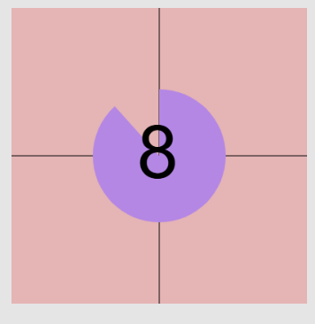

# Mysterious Countdown

Marciano Faugno

[View this project online](index.html)

## Description

This description should help the reader understand what the program is, anything they should know to be able to experience it (controls, special features, etc.), and what the desired user experience is. For example:

This p5 project is very simple and non-interactive. simply acess the file to start a 9 second countdown with a little surprise at the end ! this is a simple, light-hearted experience meant to be send to your friends and family ! :D

the project was built as apart of the first prototyping assignment to learn more functionality within p5 and to get familar with coding in javascript. 

## Screenshot(s)

> 

## Attribution

This bit should attribute any code, assets or other elements used taken from other sources. For example:

> - This project uses [p5.js](https://p5js.org).
> - The screen shot is captured directly in my personal browser with all the elements produced within p5
> - The gif at the end of the countdown is from tenor (https://tenor.com/view/rickroll-roll-rick-never-gonna-give-you-up-never-gonna-gif-22954713)
> - youtube to mp3 (https://cnvmp3.com/v55)
> - Rick Astley - Never Gonna Give You Up (Official Video) (4K Remaster) (https://www.youtube.com/watch?v=dQw4w9WgXcQ&t=1s)

## License

> This project is licensed under a Creative Commons Attribution ([CC BY 4.0](https://creativecommons.org/licenses/by/4.0/deed.en)) license with the exception of libraries and other components with their own licenses.