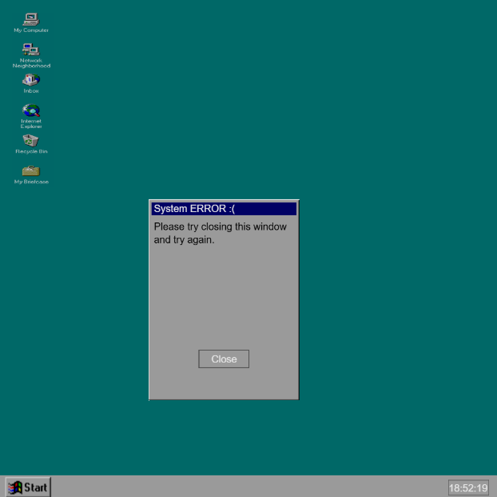

[Home](./README.md) / [Assignments](./Assignments.md) / [Reflective Journal](./journal.md)

## Variable prototypes

### ERROR !

- [View online](./ERROR/index.html)

- [View code](https://github.com/March-exe/cart253/tree/main/topics/assignments/Prototypes/variable-prototypes/ERROR)

### 2

- [View online]()
- [View code]()

### 3

- [View online]()

- [View code]()