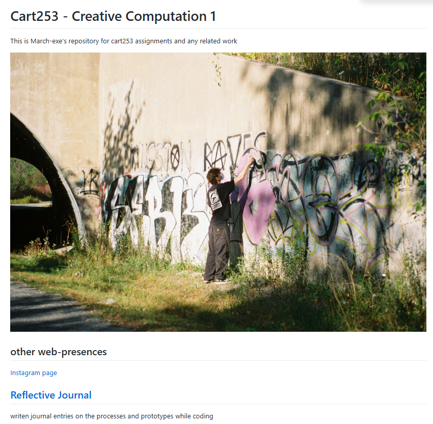

# Entry 1 response:

It was really cool to make a website on GitHub since I've never done it before. I didn't realize how easy it was to do with just a few files and folders. I always saw websites as a big coding/programming task, not this easy. I also never realized you could self-host it for free on GitHub since all the other website generators or domain purchasing requires money. I was surprised with how easy markdown is, with a very intuitive nature of use with its symbols. I also never realized that Markdown was the basis and foundation for many text editors/applications like discord use Markdown visually to indicate what is bold, italics, etc. 

As much as I intuitively understand programming from my notice experience, I still do not have a grasp of what script.js & style.css truly means or how they can be used/applied. As the semester goes on, I hope to have a better grasp of these file types and understand their abilities/limitations for web design and further use. JavaScript as a concept was first introduced to me through Minecraft mods so by the end of the semester, I also hope to have a proper understanding of the way they are made, both to try myself, and to have a stronger appreciation of the effort people have put into these projects.  

My future aspirations are to take my website beyond basic functionality and put creative design decisions into it so that navigation is both visually and interactively interesting. 

